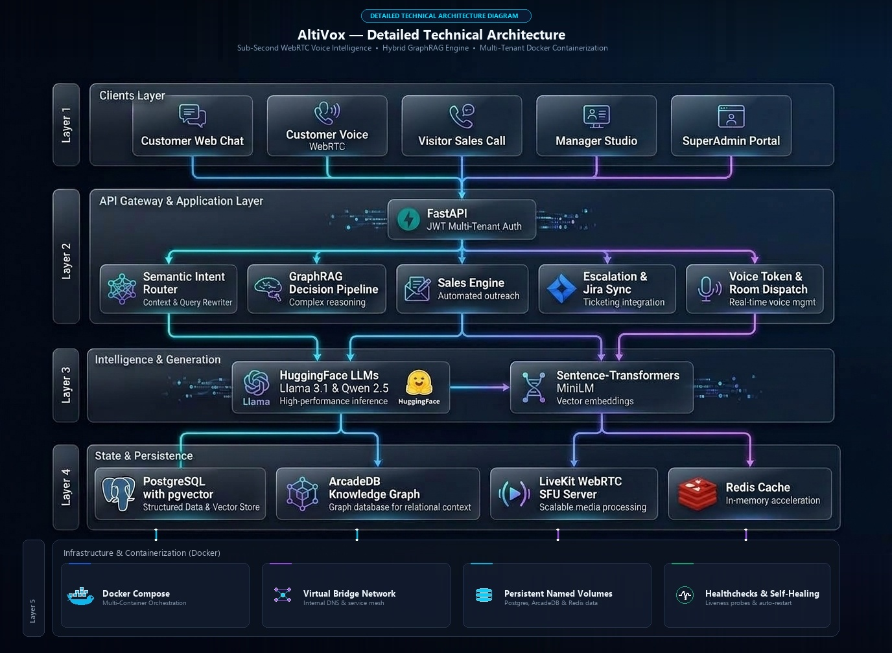
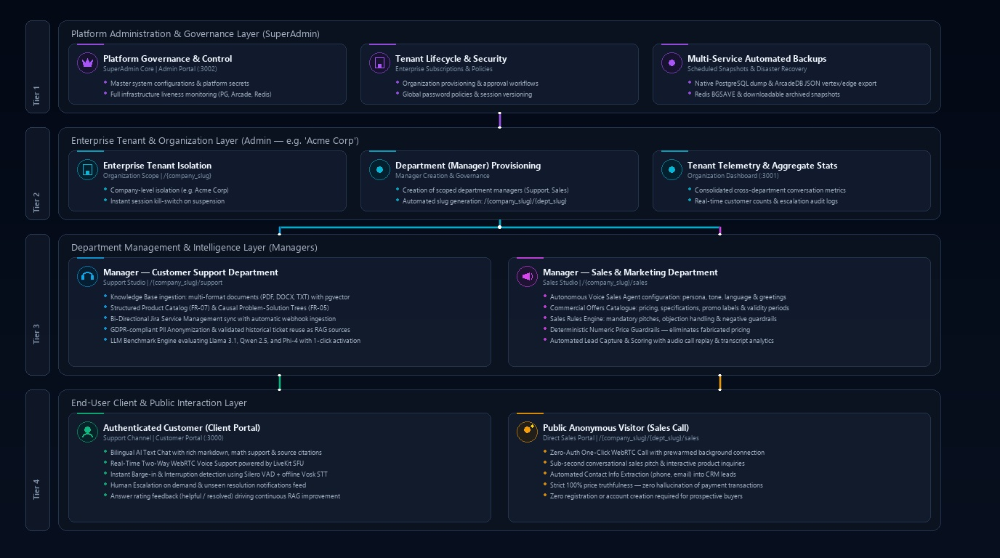

<div align="center">

# 🎙️ SupportAi (AltiVox)
### Enterprise-Grade Conversational AI Platform with Hybrid GraphRAG, Sub-Second WebRTC Voice & Autonomous Sales Intelligence

[](https://fastapi.tiangolo.com)
[](https://python.org)
[](https://github.com/pgvector/pgvector)
[](https://arcadedb.com)
[](https://livekit.io)
[](https://redis.io)
[](https://react.dev)
[](https://docker.com)
[](#license)

<p align="center">
  <b>A unified multi-tenant conversational platform bridging factual knowledge graphs with dense vector search, coupled with real-time neural speech synthesis, instant barge-in voice streaming, and closed-loop Jira Service Management.</b>
</p>

[System Architecture](#-system-architecture) •
[Core Pillars](#-core-architectural-pillars) •
[Multi-Tenant Hierarchy](#-hierarchical-multi-tenant-architecture) •
[Tech Stack](#-technology-stack) •
[Getting Started](#-getting-started--local-development) •
[Authors](#-authors--acknowledgments)

---

</div>

## 📌 Executive Summary & Problem Statement

Most enterprise Retrieval-Augmented Generation (RAG) deployments fail in mission-critical environments because **pure vector similarity search is fundamentally context-blind**:
* **Lack of Structural & Causal Reasoning:** Cosine similarity retrieves text chunks that *sound* related, but cannot discern parent-child relationships, causal dependencies (`Problem → Cause → Solution`), or business hierarchy.
* **Severe Latency in Voice Pipelines:** Traditional conversational voice bots rely on chained HTTP request-response cycles (HTTP STT $\to$ HTTP LLM $\to$ HTTP TTS), incurring **2,000–3,500ms** latency that disrupts natural conversation.
* **Pricing & Hallucination Vulnerability in Sales:** Autonomous sales bots frequently invent discounts or hallucinate unauthorized pricing when navigating complex product catalogues.
* **Siloed Human Escalation:** When bots fail, context is lost, forcing customers to repeat their issues to human agents with zero auditability or resolution synchronization.

**SupportAi (AltiVox)** resolves these fundamental challenges from the ground up through a **5-tier unified architecture** combining **Hybrid GraphRAG** (PostgreSQL 18 `pgvector` + ArcadeDB typed Knowledge Graph), **sub-second on-premise WebRTC voice streaming** (LiveKit SFU + Vosk STT + Silero VAD + Piper TTS), an **autonomous finite-state sales engine with deterministic numeric price guardrails**, and **bi-directional Jira Service Management synchronization**.

---

## 🏛️ System Architecture

The platform is structured into **5 distinct operational layers** ensuring strict separation of concerns, scalability, and sub-second response times:

<div align="center">
  
  <p><i>Figure 1: AltiVox 5-Layer End-to-End System Topology (Dark Edition)</i></p>
  <sub>💡 <i>Light theme diagram available at <a href="./assets/altivox_system_architecture_light.jpg">assets/altivox_system_architecture_light.jpg</a></i></sub>
</div>

### Architectural Layers Breakdown

| Layer | Component | Description & Responsibilities |
|---|---|---|
| **Layer 1** | **Clients & Portals** | React 18 + Vite web applications delivering Customer Web Chat, Real-Time WebRTC Voice Support, Public Zero-Auth Visitor Sales Calls, Department Manager Studio, and SuperAdmin Governance. |
| **Layer 2** | **API Gateway & Core Application** | Asynchronous FastAPI service handling JWT authentication, multi-tenant routing, **Semantic Intent Router** (13-class intent classification & multi-turn query rewriting), **GraphRAG Decision Pipeline**, 6-stage **Marketing Sales Engine**, **Jira Escalation Engine**, and WebRTC room dispatchers. |
| **Layer 3** | **Intelligence & Generation** | HuggingFace Inference API (`Llama-3.1-8B-Instruct`, `Qwen-2.5-7B`, `Phi-4`) combined with local 384-dimensional dense semantic embeddings (`sentence-transformers/all-MiniLM-L6-v2`). |
| **Layer 4** | **State & Persistence** | Dual-database persistence: **PostgreSQL 18** with `pgvector` (source of truth, relational data, and vector indexing), **ArcadeDB 26.7.3** (typed property knowledge graph for causal relations), **LiveKit WebRTC Server :7880** (low-latency SFU), and **Redis 7 / Memurai** (in-memory sessions, rate-limiting & cache). |
| **Layer 5** | **Infrastructure & Containerization** | **Docker Compose** orchestration with virtual bridge networks (`altivox-network`), persistent named volumes, continuous container healthchecks, auto-restart policies, and 23 sequential Alembic schema migrations. |

---

## ⚡ Core Architectural Pillars

### 1. 🧠 Hybrid GraphRAG (Zero-Hallucination Gating)
Vector embeddings capture semantic proximity but fail at structural causality. SupportAi integrates PostgreSQL 18 (`pgvector`) with ArcadeDB’s Knowledge Graph using a weighted **Reciprocal Rank Fusion (RRF)** algorithm:

$$\text{RRF Score}(d) = 0.6 \times \text{VectorScore}(d) + 0.4 \times \text{GraphScore}(d)$$

* **Strict Anti-Hallucination Gate:** Queries are physically isolated at the database layer. The retrieval pipeline only traverses manager-validated company nodes and hierarchical causal problem-solution trees:
  $$\text{Product} \longrightarrow \text{Problem} \longrightarrow \text{Cause} \longrightarrow \text{Solution}$$
* **Deterministic Fallback:** If retrieval confidence drops below threshold ($\tau < 0.65$), the system gracefully triggers an out-of-scope response or initiates human escalation rather than fabricating an answer.
* **Semantic Query Rewriting:** Converts ambiguous multi-turn user follow-ups (e.g., *"it still doesn't turn on"*) into fully contextualized self-contained queries prior to graph retrieval.

---

### 2. 🎙️ Sub-Second Real-Time WebRTC Voice Intelligence
Traditional conversational AI systems suffer from **2,000–3,500ms** latency due to cascading HTTP round-trips. SupportAi completely decouples the voice pipeline from HTTP request cycles:

```
[Customer Audio] ──WebRTC (UDP)──► [LiveKit SFU :7880]
                                          │
                        ┌─────────────────┴─────────────────┐
                        ▼                                   ▼
             [Silero VAD (Interruption)]           [Vosk STT (Offline)]
                        │                                   │
                        │ <50ms barge-in                    ▼
                        └──────────────────────────► [FastAPI Brain]
                                                            │
                                                            ▼
                                                   [Piper Neural TTS]
                                                            │
                                                   <200ms audio stream
                                                            │
[Customer Ear] ◄──WebRTC (UDP)── [LiveKit SFU] ◄────────────┘
```

* **LiveKit WebRTC SFU:** Full duplex audio streaming over UDP with automated pre-warmed room allocation for instant, zero-wait call initiation.
* **Local Offline Vosk STT & Silero VAD:** Sub-50ms Voice Activity Detection enables **instant barge-in / user interruption handling**—the AI stops speaking immediately when the user talks.
* **Piper Neural ONNX TTS:** Fast, high-fidelity neural voice synthesis running directly on-premise without per-minute cloud vendor costs or external API latency.

---

### 3. 💼 Autonomous Marketing & Sales Agent with Hard Guardrails
Building an AI chatbot that converses is trivial; building an autonomous sales agent that **never invents unauthorized prices or discounts** is an enterprise challenge.

* **6-Stage Finite State Machine (FSM):**
  $$\text{CATALOGUE} \longrightarrow \text{PITCH} \longrightarrow \text{OBJECTION} \longrightarrow \text{CROSS\_SELL} \longrightarrow \text{CONTACT} \longrightarrow \text{CLOSE}$$
* **Deterministic Numeric Price Guardrail:** An algorithmic pre-generation validation layer scans generated responses using strict regex patterns against official catalogue pricing tables. If an unauthorized price or hallucinated discount is detected, the turn is instantly neutralized before audio synthesis.
* **Real-Time Lead Qualification:** Automatically extracts customer intent, timeline, budget, and contact info, persisting scored leads directly into PostgreSQL.

---

### 4. 🔄 Closed-Loop Jira Sync & Automated PII Anonymization
SupportAi bridges the gap between automated AI resolution and human engineering support:

* **Automatic Escalation:** Triggered automatically when confidence drops, sentiment deteriorates, or the customer explicitly requests human assistance.
* **Bi-Directional Webhooks:** A Jira Service Management ticket is created with full conversation history and classification. When a human engineer resolves the ticket in Jira, a webhook pushes the resolution back into SupportAi.
* **GDPR-Compliant Knowledge Ingestion:** Managers can review resolved tickets and ingest them directly into the Knowledge Graph after automated regex/NLP PII scrubbing (anonymizing customer names, emails, IPs, phone numbers, and credentials).

---

## 👥 Hierarchical Multi-Tenant Architecture

SupportAi enforces strict data and session isolation across a **4-tier organizational hierarchy**. Cross-tenant data leakage is mathematically prevented via row-level `manager_id` filtering on all SQL and vector queries.

<div align="center">
  
  <p><i>Figure 2: Hierarchical 4-Tier Multi-Tenant Role Architecture</i></p>
  <sub>💡 <i>Light theme diagram available at <a href="./assets/altivox_role_hierarchy_light.jpg">assets/altivox_role_hierarchy_light.jpg</a></i></sub>
</div>

### Tier Breakdown

```
                         ┌─────────────────────────────────────────┐
                         │      TIER 1: SuperAdmin (Platform)      │
                         │   Global Governance, Health, Backups    │
                         └────────────────────┬────────────────────┘
                                              │
                                              ▼
                         ┌─────────────────────────────────────────┐
                         │      TIER 2: Enterprise Tenant (Admin)  │
                         │       Company-Level: /{company_slug}    │
                         └──────────┬───────────────────┬──────────┘
                                    │                   │
                 ┌──────────────────┴──┐             ┌──┴──────────────────┐
                 │                     │             │                     │
                 ▼                     ▼             ▼                     ▼
     ┌───────────────────────┐                 ┌───────────────────────┐
     │ TIER 3A: Manager      │                 │ TIER 3B: Manager      │
     │ Customer Support Dept │                 │ Sales & Marketing     │
     │ /{company_slug}/support│                │ /{company_slug}/sales │
     └───────────┬───────────┘                 └───────────┬───────────┘
                 │                                         │
                 ▼                                         ▼
     ┌───────────────────────┐                 ┌───────────────────────┐
     │ TIER 4A: End User     │                 │ TIER 4B: Public Guest │
     │ Authenticated Client  │                 │ Anonymous Sales Call  │
     │ Chat & Voice Support  │                 │ Zero-Auth WebRTC Call │
     └───────────────────────┘                 └───────────────────────┘
```

1. **Tier 1 — SuperAdmin (Platform Owner):** Platform governance, subscription lifecycle (`pending` $\to$ `active` $\to$ `suspended`), multi-tier automated database backups (Postgres, ArcadeDB, Redis), password security policies, and live infrastructure health probes (`Admin Portal :3002`).
2. **Tier 2 — Admin (Enterprise Tenant):** Company-level tenant (`/{company_slug}`). Creates and provisions departmental managers, monitors aggregated tenant metrics, and manages subscription quotas (`Manager Portal :3001`).
3. **Tier 3 — Department Managers:**
   * **Tier 3A (Customer Support):** Manages knowledge base documents, structured products, problem-solution graph trees, Jira SLA sync, and automated LLM benchmarking.
   * **Tier 3B (Sales & Marketing):** Manages commercial offers, pitch sequences, objection handling rules, deterministic price guardrails, and lead qualification feeds.
4. **Tier 4 — End Users & Visitors:**
   * **Tier 4A (Authenticated Customer):** Grounded bilingual chat and low-latency voice call (`Customer Portal :3000`).
   * **Tier 4B (Public Anonymous Visitor):** One-click, zero-auth direct WebRTC sales consultation call (`/{company_slug}/{dept}/sales`).

---

## 🛠️ Technology Stack

```text
┌──────────────────────────────────────────────────────────────────────────────────┐
│                                   TECH STACK                                     │
├───────────────────┬───────────────────────────────────┬──────────────────────────┤
│ Subsystem         │ Technology / Framework            │ Purpose / Implementation │
├───────────────────┼───────────────────────────────────┼──────────────────────────┤
│ Backend Logic     │ Python 3.12, FastAPI (Async)      │ Core API & Gateway       │
│ ORM & Validation  │ SQLAlchemy 2.0, Pydantic v2       │ Relational data models   │
│ Primary Database  │ PostgreSQL 18 + pgvector          │ Structured store & vector│
│ Knowledge Graph   │ ArcadeDB 26.7.3 (HTTP/JSON)       │ Causal graph traversal   │
│ In-Memory Store   │ Redis 7 / Memurai                 │ Fast state & rate limits │
│ WebRTC SFU Server │ LiveKit Server (:7880)            │ Real-time voice transport│
│ Speech Recognition│ Vosk STT (Offline, FR & EN)       │ Local voice-to-text      │
│ Voice Activity Det│ Silero VAD                        │ Sub-50ms user barge-in   │
│ Speech Synthesis  │ Piper Neural ONNX TTS             │ Local high-speed TTS     │
│ Large Language Mod│ Llama 3.1 8B, Qwen 2.5 7B, Phi-4  │ Multi-model inference    │
│ Embeddings Model  │ sentence-transformers (MiniLM-L6) │ 384-dim dense vectors    │
│ Frontend Portals  │ React 18, Vite, TailwindCSS       │ Modern responsive UI     │
│ Ticketing Sync    │ Jira Service Management API       │ Bi-directional escalation│
│ Containerization  │ Docker Compose, Linux             │ Virtualized deployment   │
│ Schema Migrations │ Alembic (23 revisions)            │ Database versioning      │
└───────────────────┴───────────────────────────────────┴──────────────────────────┘
```

---

## 🚀 Getting Started & Local Development

### Prerequisites
* **Docker & Docker Compose** (v24+)
* **Python 3.12+**
* **Node.js 20+** & **pnpm / npm**
* **Speech Models:** Vosk language models (`vosk-model-fr-0.22`, `vosk-model-en-us-0.22`) and Piper ONNX voices placed in your designated model directory.

### Quickstart with Docker Compose

1. **Clone the repository:**
   ```bash
   git clone https://github.com/MahranHadjSalah/SupportAi.git
   cd SupportAi
   ```

2. **Configure Environment Variables:**
   ```bash
   cp .env.example .env
   # Edit .env with your PostgreSQL credentials, ArcadeDB password, and HuggingFace API key
   ```

3. **Spin up the infrastructure:**
   ```bash
   docker compose up -d postgres arcadedb redis livekit
   ```

4. **Run Database Migrations:**
   ```bash
   cd backend
   alembic upgrade head
   ```

5. **Start Application Services:**
   * **FastAPI Backend:** `uvicorn main:app --host 0.0.0.0 --port 8000 --reload`
   * **Voice Worker:** `python services/voice/worker.py`
   * **Customer Portal (:3000):** `cd frontend/customer && npm run dev`
   * **Manager Portal (:3001):** `cd frontend/manager && npm run dev`
   * **Admin Portal (:3002):** `cd frontend/admin && npm run dev`

---

## 🔒 Security, Isolation & Compliance

* **Row-Level Tenant Partitioning:** Every query executed against PostgreSQL or ArcadeDB is strictly bounded by the authenticated tenant's `manager_id`.
* **Instant Session Revocation Cascade:** Suspending an enterprise tenant immediately invalidates all active JWT tokens via `session_version` bumping and severs ongoing LiveKit WebRTC rooms in real time.
* **PII Redaction Engine:** Automated regex and NLP filters scrub sensitive personally identifiable information (GDPR compliant) prior to ticket resolution storage in the Knowledge Graph.
* **Database Backups:** Automated multi-tier disaster recovery engine creates scheduled, timestamped snapshots of PostgreSQL, ArcadeDB, and Redis.

---

## 👨‍💻 Authors & Acknowledgments

Engineered and developed as a collaborative summer engineering internship project by:

* **Mahran Hadj Salah** — *Co-Architect & Systems Engineer* — [GitHub](https://github.com/MahranHadjSalah) • [LinkedIn](https://linkedin.com)
* **Eya Chouchane** — *Co-Architect & Systems Engineer* — [GitHub](https://github.com/eya1ch)

Special thanks to our mentors, technical advisors, and internship supervisors for granting us the architectural autonomy, resources, and guidance required to bring AltiVox from theoretical design to production-grade implementation.

---

## 📄 License

This project is licensed under the **MIT License** — see the [LICENSE](LICENSE) file for details.
